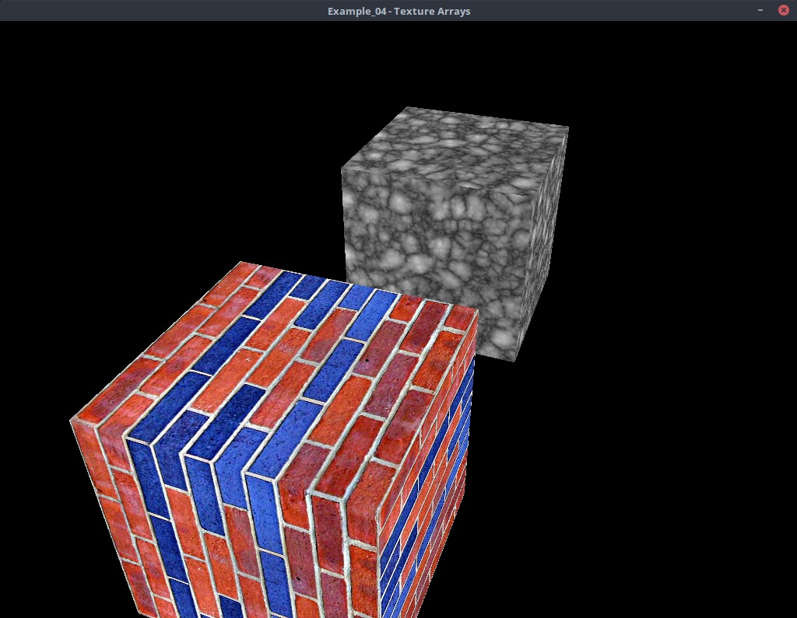
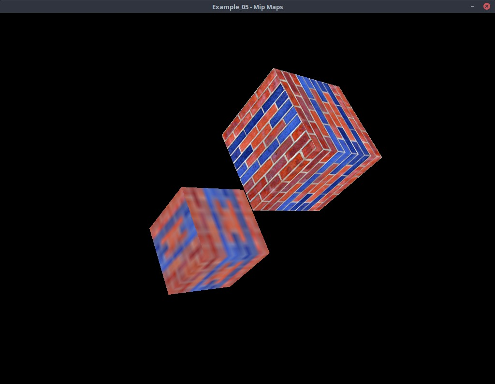

# VKA - Vulkan Assistant


VKA (Vulkan assistant) is a vulkan helper library to assist in working with
vulkan objects. It is very much a work in progress as I continue to teach myself
to use vulkan.

The intent of the library is to provide helper functions to generate objects
that are commonly used for rendering 3D graphics such as buffers, textures,
etc.  For example, setting up a texture may take many lines of code to
initialize. Using vka, we can create a texture by:

```C++
vka::texture2d * tex = context.new_texture2d("my_texture");
tex->set_size( 1024, 1024 );
tex->set_format(vk::Format::eR8G8B8A8Unorm);
tex->set_mipmap_levels(1);
tex->create();
tex->create_image_view(vk::ImageAspectFlagBits::eColor);
```

## License

Copyright 2018 GavinNL

Permission is hereby granted, free of charge, to any person obtaining a copy of
this software and associated documentation files (the "Software"), to deal in
the Software without restriction, including without limitation the rights to
use, copy, modify, merge, publish, distribute, sublicense, and/or sell copies of
the Software, and to permit persons to whom the Software is furnished to do so,
subject to the following conditions:

The above copyright notice and this permission notice shall be included in all
copies or substantial portions of the Software.

THE SOFTWARE IS PROVIDED "AS IS", WITHOUT WARRANTY OF ANY KIND, EXPRESS OR
IMPLIED, INCLUDING BUT NOT LIMITED TO THE WARRANTIES OF MERCHANTABILITY, FITNESS
FOR A PARTICULAR PURPOSE AND NONINFRINGEMENT. IN NO EVENT SHALL THE AUTHORS OR
COPYRIGHT HOLDERS BE LIABLE FOR ANY CLAIM, DAMAGES OR OTHER LIABILITY, WHETHER
IN AN ACTION OF CONTRACT, TORT OR OTHERWISE, ARISING FROM, OUT OF OR IN
CONNECTION WITH THE SOFTWARE OR THE USE OR OTHER DEALINGS IN THE SOFTWARE.


## Dependencies

VKA uses the following libraries.
 * Vulkan SDK
 * GLM - for linear algebra
 * STB - for image loading

The VulkanSDK is required to build this library (obviously). If you do not have
the VulkanSDK installed on your computer, follow the steps on this website:
https://vulkan.lunarg.com/doc/view/latest/linux/getting_started.html

If you already have GLM and STB installed on your system. Simply clone the
repo with the following command:

```bash
git clone http://github.com/gavinNL/vka.git
```

If you do not have GLM or STB, you can recursively download the submodules
using the ```--recursive comand```

```bash
git clone --recursive http://github.com/gavinNL/vka.git
```

## Build Instructions

```bash
git clone --recursive http://github.com/gavinNL/vka.git
cd vka
mkdir build
cd build
cmake ..
make
ln -s $PWD/../resources resources
```

## Examples

### Example_01 - Hello Rotating Textured Triangle


This example sets up a vulkan window, loads a texture and then draws a triangle
using the texture while animating it rotating. This example shows the simple
concept of the graphics pipeline.

---

### Example_02 - Depth Testing


This example demonstrates how to setup a rendering pipeline using depth
testing. Depth testing is an integral part of almost all rendering pipelines.
It allows objects closer to the camera to occulude objects farther from the
camera without having to pre-sort the triangles.

---

### Example_03 - Dynamic Uniform Buffers


Dynamic uniform buffers are used to send object data to the shader, simlarly
to how regular Uniform buffers work, but instead of binding the entire buffer
we bind a small portion of it which is visible to the shader.

In the previous example we used a uniform buffer to pass the Model, View
and Projection matrices to the shader so that we can render a perspective
camera. The View and Projection matrices are camera specific and generally only
change once per frame. The Model matrix determines the transformation of
an object and is different for each object in the scene. Each object rendered
will have a different model matrix, while every object will have the same
View and Projection matrix.

In this example wee will use a regular Uniform Buffer to pass in per frame data
(Projection and View matrix) and a Dynamic Uniform Buffer to pass in per
object data (model matrix)

---

### Example_04 - Texture Arrays and Push Constants



Texture arrays have many uses. A typical 3d scene has mulitple objects
each having different textures. It is unwise to use a single texture
for each object and then bind the texture when we are going to draw that
object. Instead a texture array can hold a vast number of textures, and
we can tell the object which layer in the array to use by passing it
the data through the dynamic uniform buffer or using push constants.

Push Constants are data which can be passed to the shader by directly writing
to the command buffer. Push constants have a maximum size but is garanteed
to be at least 128 bytes. Push Constants are ideal when you need to send
small bits of data such as a simple index into an array.

In this example, we are going to create a texture array with 2 textures and then
use Push Constants to tell the shader what layer to use when rendering the object.

---

### Example_05 - Mipmaps



Mipmaps are a downsampled version of a texture. If a square texture has
dimensions 512x512, then a level 1 mipmap would be 256x256, a level 2 would
be 128x128, and so forth all the way down to 1x1.

Mipmaps are used when rendering objects far from the camera, if the texture
is too detailed, then when an object is far away, two pixels close together on
the screen might actually be very far apart on the texture. This creates large colour
variances in objects farther away. The mipmap level is chosen dynamically based
on how far away the pixel is on the screen.

The a specific mipmap level can also be chosen by using the textureLod( )
GLSL function.

This example demonstrates how to generate mipmaps for a texture array. The
mipmaps are generated in two ways; manually and one automatically with a single
function call.


---
