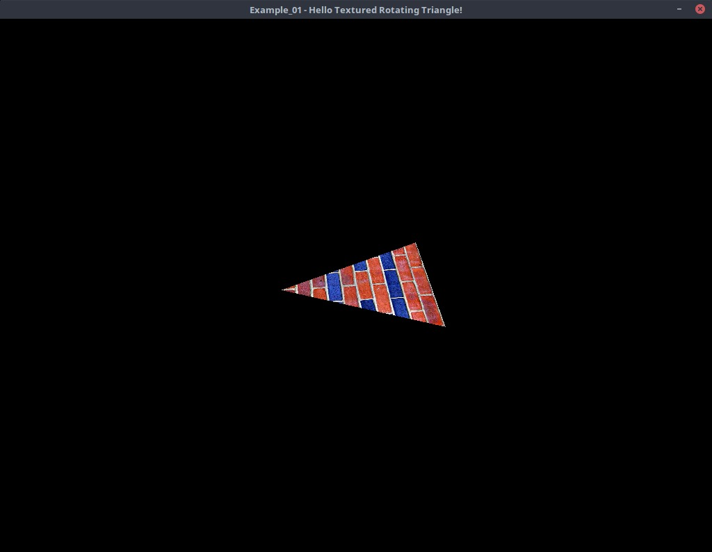
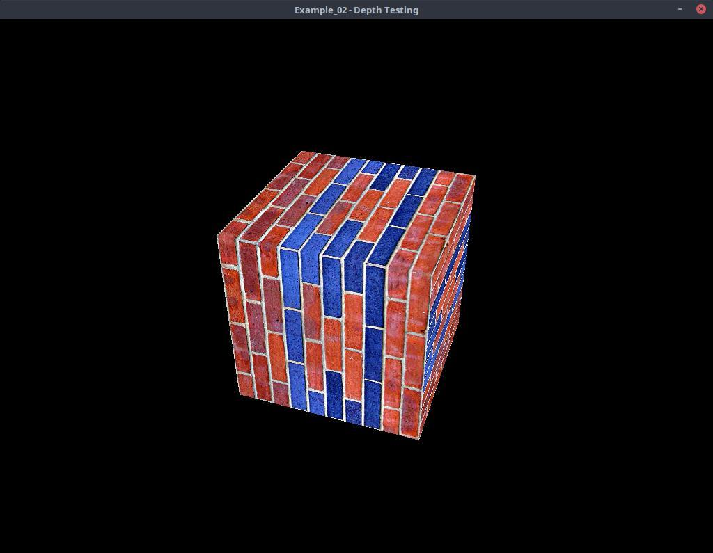
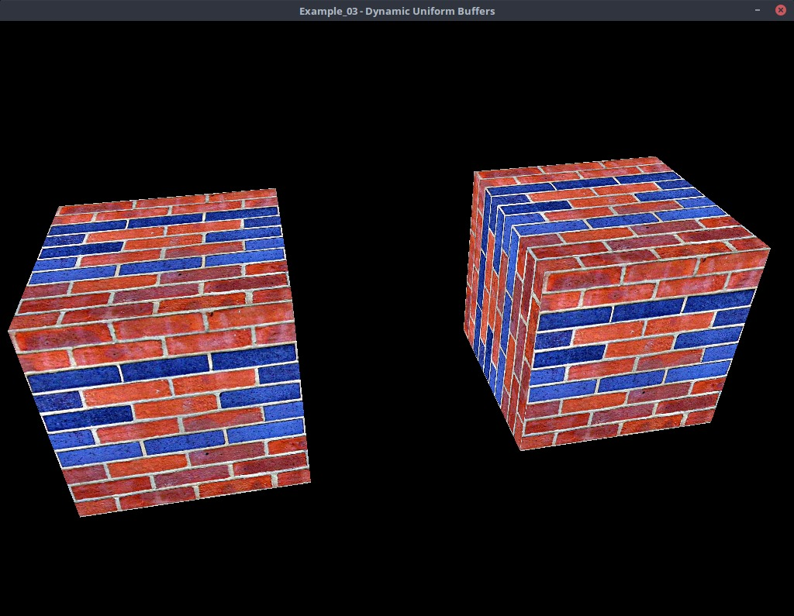

# VKA - Vulkan Assistant

License: MIT

VKA (Vulkan assistant) is a vulkan helper library to assist in working with
vulkan objects. It is very much a work in progress as I continue to teach myself
to use vulkan.


The intent of the library is to provide helper functions to generate objects
that are commonly used for rendering 3D graphics such as buffers, textures,
etc.  For example, setting up a texture may take many lines of code to
initialize. Using vka, we can create a texture by:

```C++
vka::texture2d * tex = context.new_texture2d("my_texture");
tex->set_size( 1024, 1024 );
tex->set_format(vk::Format::eR8G8B8A8Unorm);
tex->set_mipmap_levels(1);
tex->create();
tex->create_image_view(vk::ImageAspectFlagBits::eColor);
```


## Dependencies

VKA uses the following libraries.
 * GLM - for linear algebra
 * STB - for image loading

These libraries are set as submodules.

## Examples

### Example_01 - Hello Rotating Textured Triangle



This example sets up a vulkan window, loads a texture and then draws a triangle
using the texture while animating it rotating. This example shows the simple
concept of the graphics pipeline.

---

### Example_02 - Depth Testing



This example demonstrates how to setup a rendering pipeline using depth
testing. Depth testing is an integral part of almost all rendering pipelines.

---

### Example_03 - Dynamic Uniform Buffers



This example demonstrates how to use dynamic uniform buffers to pass data to
each object drawn.

---
